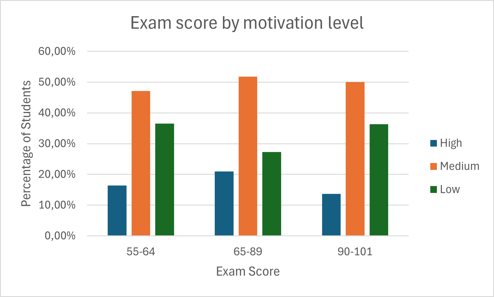
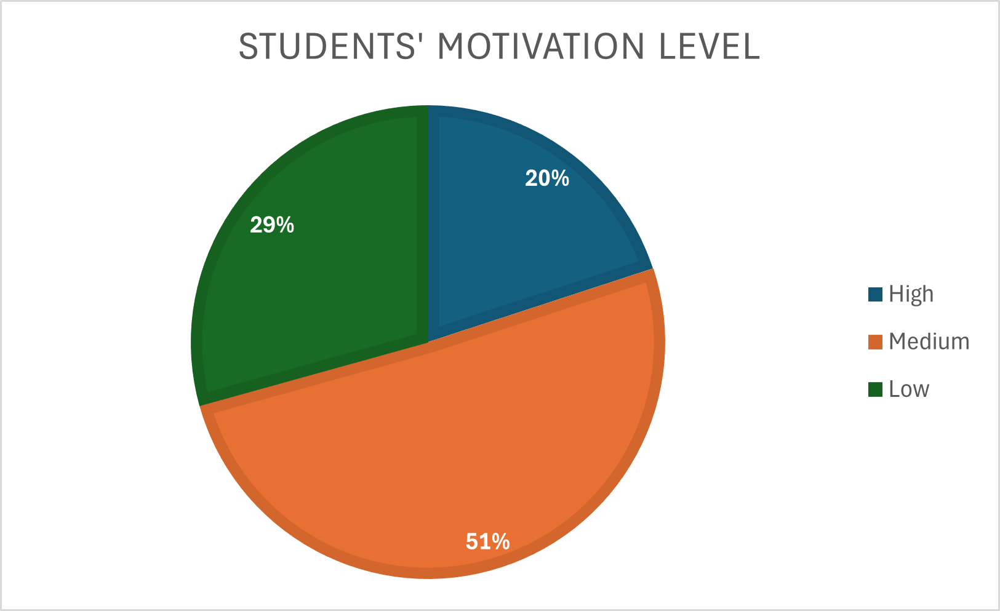

# Low motivation - High results  
## Dataset and Methodology

The dataset used in this analysis was sourced from Kaggle: [Student Performance Factors](https://www.kaggle.com/datasets/lainguyn123/student-performance-factors).

The methodology involved cleaning and analyzing the data using Excel. Key factors were examined to determine their impact on student success, particularly in relation to motivation levels.

## 1. Does Motivation Play a Key Role for Students?  

The chart below presents the percentage distribution of students in each performance group based on their level of motivation. Among the top-performing students, the majority have a **medium** level of motivation, while the **least represented** group consists of students with a **high** level of motivation.  

Comparing the overall number of students with the top-performing group, we can see that motivation levels are similarly distributed in both groups. This suggests that it is natural for students with a **medium** level of motivation to dominate in every performance group.  

Let’s take a closer look at students with the **lowest motivation level**. In this group, the highest proportion of top-performing students per capita can be found. I will attempt to explain this phenomenon in the second part of my analysis.  

---

## 2. The Key to Success: Motivation or Something Else?  

The number of hours spent studying per week, attendance at classes, extracurricular activities, and tutoring sessions—these four factors should have the greatest impact on exam performance.  

### Key Observations:  

- **87.50% of top-performing students with low motivation dedicated at least 17 hours per week to studying.**  
  This is the highest result among students with different motivation levels.  

- **Class attendance was also a key factor** – low-motivation students accounted for **40% of all top-performing students who attended at least 80% of classes**.  

### Conclusion:  

By combining these two factors, we can see that students who achieved the **highest exam scores, studied the most, and had the highest attendance rates were... mostly those with a low level of motivation!**  

### Final Thoughts:  

Attending classes and consistently reviewing acquired knowledge have a **significant impact on exam results**, even when motivation is low.  

💡 **Before opting for expensive tutoring, consider whether you have fully utilized the available resources**, such as:  
✅ **Regular class attendance**  
✅ **Reinforcing knowledge through self-study**  

All tables and charts supporting these conclusions can be found in the 'tables_and_charts' file included in this repository.
